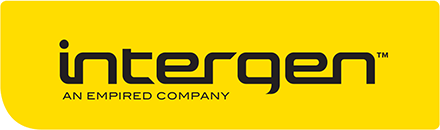

<h1 align="center">Modern Applications Graduate Handbook</h1>

## Contents
1. [Welcome](#welcome)
1. [Languages](#languages)
1. [Tools](#tools)
1. [Concepts and Technologies](#concepts-and-technologies)
    1. [Fundamentals](#fundamentals)
    1. [Server](#server)
    1. [Client](#client)
    1. [Database](#database)
1. [Useful resources](#useful-resources)
    1. [Freebies](#freebies)
    1. [Common acronyms](#common-acronyms)
    1. [Books](#books)
    1. [Podcasts](#podcasts)

## Welcome
Welcome to Intergen!

This list includes many of the tools and technologies used by the Modern Applications team at Intergen. **We do not expect you to go off and learn everything about these before you get here.** Instead, take a look at our technology stack in the areas that interest you the most. This guide is also designed to serve as a quick reference for current Intergenites :)

> __Pluralsight Courses__
> 
> You'll have to use your pluralsight account to access the courses tagged with `pluralsight`

## Languages

* [C#](https://msdn.microsoft.com/en-us/library/67ef8sbd.aspx) - Used in most projects, this is our preferred language when writing server side or windows applicat\ions.
* [JavaScript](http://www.w3schools.com/js/) - Used in all web projects due to it's popularity and ubiquitous support.
* [TypeScript](https://www.typescriptlang.org/) - Typed superset of JavaScript that compiles into plain old JavaScript. We use TypeScript extensively as it offers static type checking and ES6 feature support.
* [Less](http://lesscss.org/) - Our CSS preprocessor of choice as it allows us to write more maintainable CSS.
* [HTML / CSS](http://www.w3schools.com/html/html_css.asp) - Makes up the presentational layer of all our applications.

## Tools

* [Intergen Dev Tools](https://github.com/Intergen-NZ/DevTools)

## Concepts and Technologies

### Fundamentals

**Version Control (Git)**
* [Git Tutorial by Github](https://try.github.io)
* [Learn Git Branching](http://learngitbranching.js.org/)

### Server

### Client

**Angular JS**
* [Angular Docs](https://docs.angularjs.org/guide) - We use Angular 1.x for most of our web projects at Intergen.
* [Angular JS Fundamentals](https://egghead.io/courses/angularjs-app-from-scratch-getting-started) - Learn the basics
* [Codeschool Course](https://www.codeschool.com/courses/shaping-up-with-angular-js) - Interactive walkthrough
* [Angular with TypeScript](https://www.pluralsight.com/courses/angular-typescript) - More or less how we do things, you'll need to auth using your Intergen pluralsight account. `pluralsight`
* [Fountain.io](http://fountainjs.io/) - Web app generators so you don't have to write boring boilerplate code.

**TypeScript**
* [TypeScript Samples](https://github.com/Microsoft/TypeScriptSamples) - Several code samples.
* [TypeScript Fundamentals](https://www.pluralsight.com/courses/typescript) - Learn the TypeScript language. `pluralsight`

**Less**
* [Less Overview](http://lesscss.org/features/) - Shows off some of the things you can do with Less.

### Database

## Useful resources

### Freebies
*You can claim these while you're still a student :book:*

* [Github Student Developer Pack](https://education.github.com/pack) - Bundles together a bunch of awesome things.
* [JetBrains IDEs and Tools](https://www.jetbrains.com/student/) - Grants access to all of JetBrains' products. We use ReSharper extensively at Intergen.

### Common acronyms
* CI - [Continuous Integration](https://www.thoughtworks.com/continuous-integration)
* CD - [Continuous Delivery](https://www.thoughtworks.com/continuous-delivery)
* GAC - [Global Assembly Cache](https://msdn.microsoft.com/en-us/library/yf1d93sz(v=vs.110).aspx)
* GUID - [Globally Unique Identifier](https://en.wikipedia.org/wiki/Globally_unique_identifier)
* IIS - [Internet Information Services](https://www.iis.net/)
* JSON - [JavaScript Object Notation](http://www.json.org/)
* JWT - [JSON Web Token](https://jwt.io/introduction/)
* MSDN - [Microsoft Developer Network](https://msdn.microsoft.com/)

### Books

### Podcasts